# 🎭 Mood Detector

A simple Python program that analyzes a user's text input and detects their mood based on emotional keywords.  
It then returns an encouraging or empathetic quote that matches the detected emotion.

---

## 🧠 How It Works

1. You type how you’re feeling (for example: “I feel so happy today!”).
2. The program converts your text to lowercase.
3. It checks for emotion-related keywords in the text.
4. The mood with the most matches is selected.
5. A motivational or comforting quote for that mood is displayed.

---

## 🚀 Features

- Detects eight moods:  
  `happy`, `sad`, `angry`, `anxious`, `tired`, `motivated`, `confused`, and `grateful`.
- Returns a **random quote** that fits the detected mood.
- Handles neutral input gracefully (no emotion detected).
- Interactive loop: keeps running until the user types `quit` or `exit`.

---

```mermaid
graph TB
    subgraph MoodDetector["🎭 MoodDetector Object"]
        A[MoodDetector Class]
    end
    
    A --> B[mood_keywords Dictionary]
    A --> C[mood_quotes Dictionary]
    
    subgraph Keywords["📚 mood_keywords Structure"]
        B --> D1['happy']
        B --> D2['sad']
        B --> D3['angry']
        B --> D4['anxious']
        B --> D5[+ 4 more moods...]
        
        D1 --> E1["['happy', 'joy', 'excited',<br/>'great', 'awesome', ...]"]
        D2 --> E2["['sad', 'unhappy', 'down',<br/>'miserable', ...]"]
        D3 --> E3["['angry', 'mad', 'furious',<br/>'annoyed', ...]"]
        D4 --> E4["['anxious', 'worried',<br/>'nervous', 'stressed', ...]"]
    end
    
    subgraph Quotes["💬 mood_quotes Structure"]
        C --> F1['happy']
        C --> F2['sad']
        C --> F3['angry']
        C --> F4[+ 5 more moods...]
        
        F1 --> G1["['Keep shining!...',<br/>'Happiness looks good...',<br/>'What a wonderful mood...',<br/>'Your joy is a gift...']"]
        F2 --> G2["['It's okay to feel sad...',<br/>'Be gentle with yourself...',<br/>'Even the darkest night...',<br/>'Your feelings are valid...']"]
        F3 --> G3["['Take a deep breath...',<br/>'Anger is valid...',<br/>'Let it out...',<br/>'Channel this energy...']"]
    end
    
    subgraph Example["📝 Example Flow"]
        H[User Input:<br/>'I feel happy and excited!']
        H --> I[Search in keywords]
        I --> J[Found: 'happy' ✓<br/>Found: 'excited' ✓]
        J --> K[happy score = 2]
        K --> L[Highest score = happy]
        L --> M[Get random quote<br/>from happy quotes]
        M --> N[Display:<br/>'Keep shining! Your<br/>happiness is contagious!']
    end
    
    %% === Styling Section ===
    style A fill:#FFD700,stroke:#333,stroke-width:3px,color:black
    style B fill:#87CEEB,stroke:#333,stroke-width:2px,color:black
    style C fill:#87CEEB,stroke:#333,stroke-width:2px,color:black
    style D1 fill:#E0FFFF,stroke:#333,stroke-width:1px,color:black
    style D2 fill:#E0FFFF,stroke:#333,stroke-width:1px,color:black
    style D3 fill:#E0FFFF,stroke:#333,stroke-width:1px,color:black
    style D4 fill:#E0FFFF,stroke:#333,stroke-width:1px,color:black
    style H fill:#90EE90,stroke:#333,stroke-width:2px,color:black
    style N fill:#98FB98,stroke:#333,stroke-width:2px,color:black

```

# 📚 Project Structure

mood-detector/       
├── MoodDetector.ipynb                      
└── README.md 
